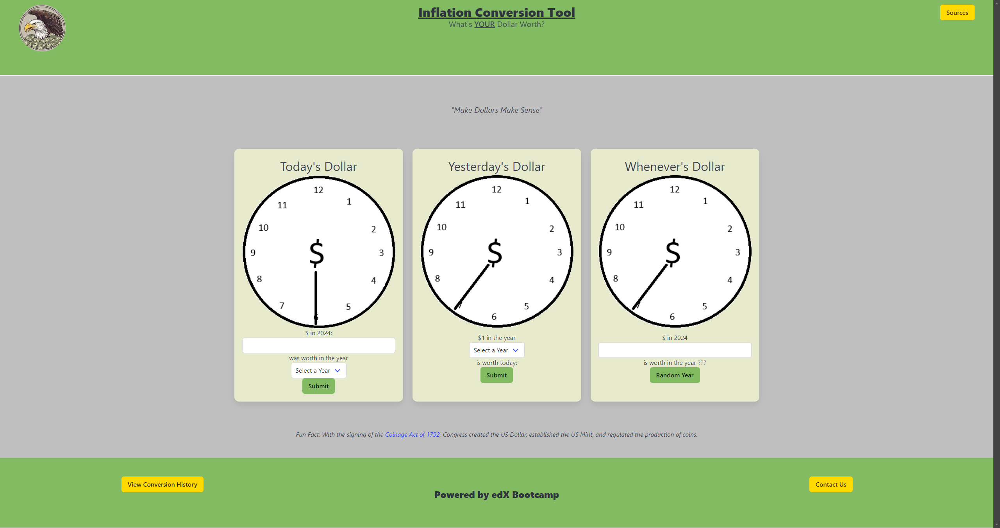
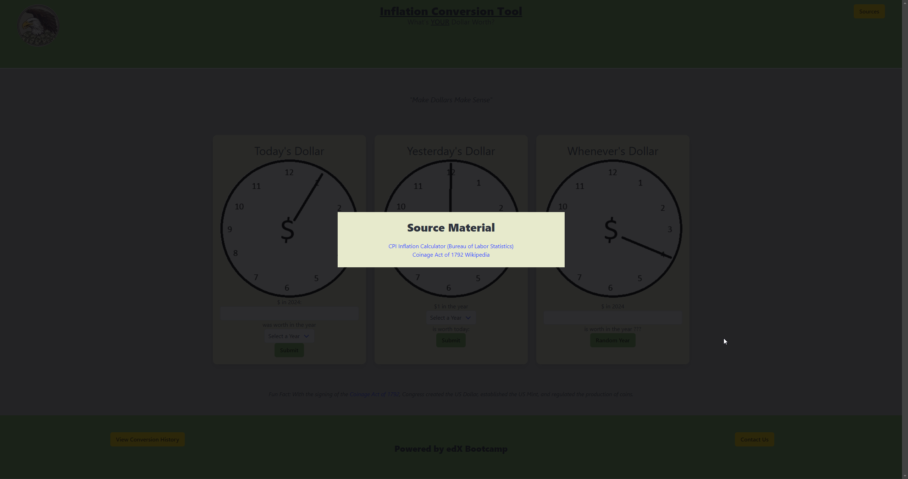
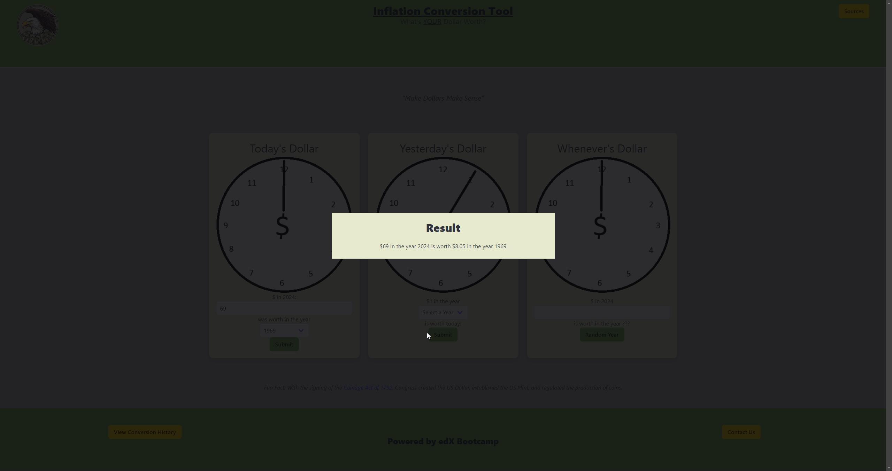
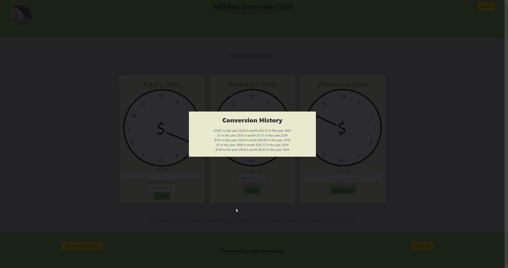

# INFALTION-CONVERSION-TOOL

## Description

With the Inflation Conversion Tool you can quickly calculate how much the U.S. dollar was worth throughout history based on the actual rates of inflation. You can now go back in time to see how much today's dollar was worth in past year as far back as 1792.

## Installation

N/A

## Usage

The user can only enter up to 18 characters of numbers in the input fields. The user can choose between the years of 1792 through 2023 (April 4th, 1792 is when the U.S. established the current currency system).

The user has three options to access inflation information:

1. Today's Dollar: The first option allows the user to input today's dollar amount inside the input field. Next the user can use the dropdown menu to select any year between 1792 through 2023 to generate the amount their dollar would be worth during the time period for the selected year.

2. Yesterday's Dollar: The second option allows the user choose a year between 1792 through 2023 to see how much a dollar would be worth in the selected year.

3. Whenever's Dollar: The third option allows the user to input today's dollar amount inside the input field, then click the "Random Year" button to generate how much the amount would be in the random year that is generated.

The user can verify the information generated is accurate by clicking on the "Sources" button, which will send them to the Bureau of Labor and Statistics.

The user can view the results of all their queries by selecting the "View Conversion History" button at the bottom of the website.

The user can also contact the creative team of the website by hitting the "Contact Us" button at the bottom of the page. A pop-up will then allow to contact the team via github.

## Screenshots

1. Application 

2. Modal Window 

3. Results Window 

4. History Window 

## Credits

Collaborators:

Eric Neff - https://www.github.com/eric7string

Louis Cary - https://www.github.com/LouisMKE

Aaron Pierce - https://www.github.com/aaronpierce2880

This website was created using following programs:

- HTML was used to build the structure and foundation of the website.

- Bulma was used to style the content, giving the website its personality.

- Javascript was utilized to bring the functionality of the website to life, making it interactive and capable of providing the user with instant results for the queries.

